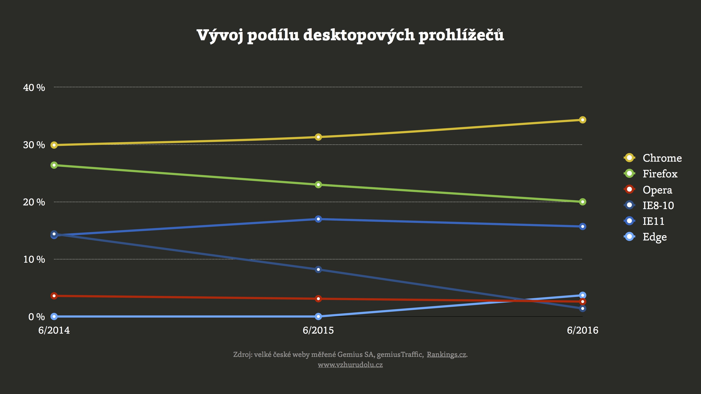
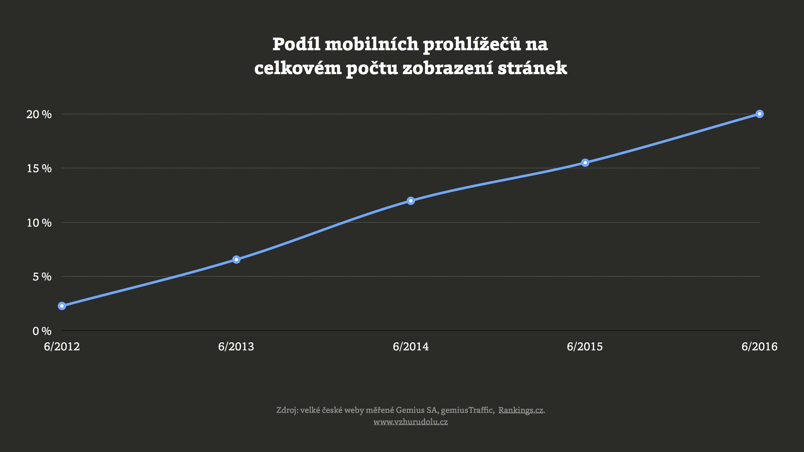

# Webdesignérův průvodce světem prohlížečů v Česku

Pojďme si shrnout aktuální stav trhu prohlížečů. Čísla v článku jsou vytažená z Rankings.cz ke konci června 2016.

*Upozornění: ve statistikách není chybně zohledněn [prohlížeč Samsung Internet](http://www.vzhurudolu.cz/blog/71-samsung-internet). Odhadem bude mít minimálně dvouprocentní podíl na trhu.*

Nejprve tři zásadní fakta:

1. **Chrome požírá trh.**    
Už nyní se v Česku dostal přes třetinu shlédnutých stránek. Ostatní prohlížeče stagnují nebo klesají.
2. **Staré Explorery už skoro vymřely.**    
Každý z Internet Explorerů kromě verze 11 už má podíl pod půl procenta a rychle klesá. Dnes je to poprvé co vám vyloženě nedoporučím pro ně dělat pracnější [fallbacky](fallback.md).
3. **Mobilní zařízení mají přes pětinu celku.**    
A více než polovina shlédnutí stránek na mobilech je opět z Chrome.

## Desktop: Chrome jako jediný masivně roste. Na desktopu má více než třetinový podíl

| Prohlížeč  |  Vývoj |  % podíl k  6/2016 |
| -----------  |  --------------------- | -----------------: |
| Chrome | ⬆ | 34,26 |
| Firefox | ⇩ | 20,37 |
| IE 11 | ⬆ | 15,66 |
| Edge | ⬆ | 3,7 |
| Opera | ⇩ | 2,6 |
| Safari | ⬆ | 1,14 |
| IE 8 | ⇩ | 0,50 |
| IE 9 | ⇩  | 0,46 |
| IE 10 | ⇩ | 0,47 |

- V posledních měsících také přestal klesat Firefox. Držím palce, aby nešlo o výjimku, protože konkurence je potřebná.
- Konec starých Internet Explorerů (IE) je tady. Už dlouho se to týká verzí 9 a 10, teď už konečně i osmičky. 
- Edge, nový moderní prohlížeč od Microsoftu, roste. Ale pomalu.
- Opera se dlouho držela kolem čtyřprocentního podílu. V posledním roce ale také začala klesat.
- Podíl desktopového Safari na Apple zařízeních v ČR k mému překvapení mírně roste. Ze supermizivého podílu se dostal na mizivý. :-) 

## Mobily: pětinový podíl na shlédnutích stránek a dominance Chrome

Na 20 % podílu ze shlédnutých stránek se mobily samozřejmě nezastaví. Za rok budou mít minimálně čtvrtinu a tak dále. Čísla ze Západu ukazují, že to půjde přes polovinu a dál. Ale vy už dávno neváháte, že budoucnost je v mobilech.

| Prohlížeč  |  Vývoj | % podíl k  6/2016 |
| -----------  |  --------------------- | -----------------: | 
| Chrome Mobile | ⬆ | 11,74 |
| Android Browser | ⇩ | 5,06 |
| Safari Mobile | ⇩ | 1,17 |

Mobilní Chrome statistiky samozřejmě v budoucnu ovládne ještě výrazněji, protože je to nyní hlavní prohlížeč na Androidu. Ano, na té platformě, která dnes vlastně na mobilech nemá masově zaměřenou konkurenci. 

## K jednotlivým prohlížečům: ke dnešku je jich minimálně 16

Ke krátkému komentáři pro zajímavost přidávám i skóre [na HTML5test.com](https://html5test.com/). To udává podporu moderních HTML5 technologií. Čím vyšší, tím lepší.

### 9 prohlížečů, se kterými prostě musíte počítat

- **[Chrome](https://en.wikipedia.org/wiki/Google_Chrome)**  
  Ten, co všechno sní. Celosvětově [podle Statcounter](http://gs.statcounter.com/) už k 60procentnímu podílu.
  <small>HTML5test.com: 492/555 (verze 52)</small>
- **[Firefox](https://en.wikipedia.org/wiki/Firefox)**  
  Celosvětově mírně klesá. Teď má [podle Statcounter](http://gs.statcounter.com/) podíl 14 %. Mozille nelze upřít snahu. Firefox chce zrychlit, [zavřela boční projekty](https://twitter.com/jsnajdr/status/785095932782190592) a přichází [s drobnými inovacemi](https://testpilot.firefox.com/experiments). Jenže Google má v případě Chrome z jejich pohledu dost nešťasnou kombinaci *umu* vyrábět výborný prohlížeč a *síly* cokoliv protlačit.
  <small>HTML5test.com: 461/555 (verze 48)</small>
- **[IE 11](https://en.wikipedia.org/wiki/Internet_Explorer_11)**  
  Podle vývoje za poslední dva roky ubrala relativně moderní jedenácka podíl ostatním prohlížečům od Microsoftu. Přepokládám, že teď začne klesat ve prospěch Edge a ostatních prohlížečů.
  <small>HTML5test.com: 312/555</small>
- **[Edge](https://en.wikipedia.org/wiki/Microsoft_Edge)**  
  Moderní prohlížeč od Microsoftu roste méně než bych čekal.
  <small>HTML5test.com: 460/555 (verze 14)</small>
- **[Opera](https://en.wikipedia.org/wiki/Opera_(web_browser))**
  Od verze 15 je postavená na stejném jádru jako Chrome, takže s testováním tolik práce není.  
  <small>HTML5test.com: 496/555 (verze 40)</small>
- **[Safari](https://en.wikipedia.org/wiki/Safari_(web_browser))**  
  Z moderních prohlížečů je to dnes největší *brzda*. Ještě nedávno byl WebKit synonymem inovací na webu, pamatujete? Aktualizuje se klasicky až s verzemi operačního systému.
  <small>HTML5test.com: 370/555 (verze 9.1)</small>
- **[Chrome Mobile](https://en.wikipedia.org/wiki/Google_Chrome_for_Android)**  
  Do dvou let bude na mobilech jednoznačně kralovat. Jedinou konkurenci má v iOS zařízeních od Apple. U Chrome na iOS pozor. Je to jen pseudoprohlížeč – jiné rozhraní pro mobilní Safari.  
  <small>HTML5test.com: 486/555 (verze 52)</small>
- **Android Browser**  
  Starší prohlížeč postavený na Webkit jádře. Modrá zeměkoule s nápisem Internet. Týká se Androidů ve verzích 4.x. Často jej upravovali výrobci zařízení, takže ho můžete znát třeba i pod názvem Samsung Browser. V téhle rodině prohlížečů je [pěkný galimatyáš](http://slides.com/html5test/the-android-browser). Už se naštěstí ale nevyvíjí. 
  <small>HTML5test.com: 356/555 (verze 30)</small>
- **[Safari Mobile](https://en.wikipedia.org/wiki/Safari_(web_browser))**  
  Jediné vykreslovací jádro dostupné na iOS. Všechny tamní prohlížeče – včetně Chrome – mají uvnitř Safari. 
  <small>HTML5test.com: 378/555 (verze 9.3)</small>

### Speciální kategorie: WebView a prohlížeče uvnitř aplikací

Většina dnešních shlédnutí webů na mobilech se neodehrává vědomým spuštěním prohlížeče, ale otevřením stránky kliknutím na odkaz uvnitř aplikací. Ve Facebooku, Twitteru nebo třeba emailové apce. [Dříve jsem o tom podrobně psal](http://www.vzhurudolu.cz/blog/19-prohlizec-facebook).

Jakým prohlížečem se pak stránka vykreslí? Vývojáři aplikací to znají jako WebView komponentu a ta startuje jádro výchozího prohlížeče pro konkrétní operační systém:

- Na iOS je to vždy mobilní Safari. 
- Na dnešních Androidech obvykle Chrome. 

I v těchto kontextech doporučuji weby testovat. Prohlížeče tam mívají trochu jiné uspořádání ovládacích prvků a některé funkce prostě neumí.

### Vymírající nebo zatím slabě zastoupené prohlížeče

Weby je možné a slušné vyrobit tak, aby se zásadně nerozsypaly ani v méně obvyklých browserech. Rozhodně ale nedoporučuji trvat na plnohodnotném fallbacku v nich. 

- **[IE 8](https://en.wikipedia.org/wiki/Internet_Explorer_8)**   
  Bylo nám spolu dobře, ale vypadá to, že jeho doba právě končí. 
  <small>HTML5test.com: 33/555</small>  
- **[IE 9](https://en.wikipedia.org/wiki/Internet_Explorer_9)**  
  IE9 běží na systémech, kde lze obvykle aktualizovat na novější verzi. 
  <small>HTML5test.com: 113/555</small>  
- **[IE 10](https://en.wikipedia.org/wiki/Internet_Explorer_10)**  
  Také IE10 běží na systémech, kde lze obvykle aktualizovat na novější verzi. Tipuji, že IE8, 9 i 10 do roka vymřou.
  <small>HTML5test.com: 265/555</small>  
- **[Internet Explorery Mobile](https://en.wikipedia.org/wiki/Internet_Explorer_Mobile)**
  Výchozí prohlížeče na Windows Phone verzí 7 a 8. V Rankings.cz se pohybují pod 0,2 %. V Analytics u relevantní projektů kolem 0,5 %.
  <small>HTML5test.com: 310/555 (verze 11 na Windows Phone 8.1)</small>  
- **[Edge Mobile](http://jecas.cz/edge-mobile)**  
  Výchozí prohlížeč na mobilních Windows 10. V Analytics vidím u cestovky s průměrnou českou návštěvností kolem 0,2 podílu %.  
  <small>HTML5test.com: 444/555 (Windows Phone 10) </small>   
- **[Opera Mobile](http://www.opera.com/cs/mobile)**
  Běžná mobilní Opera s jádrem Blink. Může mít asi 0,3 % podílu.  
  <small>HTML5test.com: 481/555 (verze 37)</small>  
- **[Opera Mini](http://www.opera.com/cs/mobile/mini)**  
  Proxy prohlížeč bez vlastního renderovacího jádra co dokáže šetřit datový objem, ale weby renderuje ošklivě. Dnes už v ČR zapadá - u cestovky vidím 0,1 % návštěv.

### Prohlížeče s menším než pětiprocentním podílem tvoří asi 15 % trhu

Jak už jsem [dříve psal](http://www.vzhurudolu.cz/blog/20-pet-procent), pětiprocentní nebo jiná hranice pro podporu prohlížečů je velmi zrádná. Prohlížeče pod touto hranicí teď tvoří kolem šestiny pageviews. 

Podporujte prostě různé prohlížeče různým způsobem a vynakládejte na to energii, které odpovídá byznys hodnotě jejich uživatelů s výhledem do budoucna.

## Renderovací jádra: vede samozřejmě Blink

K polovině prázdnin 2016 to vypadá takto:

| Jádro |  % podíl k  6/2016 |
| ----- |  ----------------: |
| Blink (Chrome, Opera) |  48 |
| Gecko (Firefox) |  20 |
| Trident (Internet Explorer) |  18,3 |
| WebKit/KHTML (Safari) |  9 |
| EdgeHTML (Edge) |  3,7 |
| Presto (Opera 12-) |  0,5 |

## Doporučení pro webaře

- Jakákoliv **obecná čísla berte s rezervou**. I ta moje. Sledujte hlavně vlastní [Google Analytics](google-analytics-vyvojari.md).
- **Nebojte se nových technologií**. [Flexbox](css3-flexbox.md) má v těchto číslech přibližně 98 % podporu. Totéž [SVG](svg.md). Obojí vám děsně ušetří práci a nabídne nové možnosti. Fallbacky ve starých prohlížečích rozhodně nedělejte plnohodnotné se zobrazením v moderních prohlížečích. Obvykle se vám to nevyplatí.
- **Nepodceňujte menší prohlížeče**. Mají sedminu shlédnutí stránek. Naučte se [testovat tak](jak-testovat-responzivni-weby.md), abyste s tím neměli moc práce.
- … a raději doslovně pro méně zkušené: Pokud by vás snad napadlo, že Web se prohlíží hlavně na Chrome a pak trochu Firefoxu, ošklivě se klamete. 

<small markdown="1">
Poznámka: Čísla v článku mám z GemiusRanking ([rankings.cz](http://rankings.cz/)). Měří podíl na shlédnutých stránkách u velkých českých webů.
</small>

