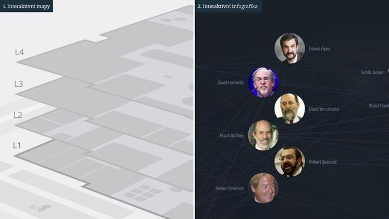

# SVG inspirace: efekty, animace, interakce, přechody a další udělátka

[SVG](svg.md) posouvá hranice možností webdesignu, ale trápí mě jak málo se to ví. V tomto textu budu proto shromažďovat ukázky možností, které SVG nabízí.

Zcela úmyslně se tady nebudu zamýšlet nad složitostí implementace, podporou v prohlížečích ani přístupností. Všechny tyto parametry jsou u různých ukázek různé. 

Než se do některých řešení pustíte, poctivě to zvažte. Můžu ale slíbit, že se k těm nejzajímavějším budu na Vzhůru dolů vracet podrobněji.

## Text: výplně, filtry, efekty 

Práce s textem je jasná volba. V případě dobré implementace je SVG text plně přístupný: indexovatelný Googlem, čtený slepeckými čtečkami a je možné jej kopírovat.

1. Výplně textu obrázky nebo barevnými přechody: [Codrops demo](http://tympanus.net/codrops/2013/12/02/techniques-for-creating-textured-text/).
2. Animované textové výplně: [Codrops demo](http://tympanus.net/codrops/2015/02/16/create-animated-text-fills/).
3. Filtry na text jako v grafickém editoru: [Článek na Smashing Magazine](https://www.smashingmagazine.com/2015/05/why-the-svg-filter-is-awesome/).
4. Animované ohraničení textu: [Codepen demo](http://codepen.io/mullany/pen/kkYNNQ). 

## Obrázky: výřezy a filtry

Ořezávání obrázků vlastními tvary bude do budoucna možné [i v CSS](http://bennettfeely.com/clippy/). SVG teď ale nabízí širší podporu v prohlížečích. Zajimavé využití nabízí SVG i pro filtry přes obrázky. Sledujte co s nimi dělá [Michael Mullany](http://codepen.io/mullany/pens/popular/).

1. Vlastní ořez obrázku: [Codepen demo](http://codepen.io/machal/pen/jrPpdO). 
2. Filtry přes fotky: [Codepen demo](http://codepen.io/machal/pen/JaECv).

## Animace

Animování jednotlivých částí SVG má daleko širší škálu výrazových prostředků než v případě elementů stránky stylovaných pomocí CSS. SVG animace – [SMIL](http://caniuse.com/#search=smil) – nemají plnou podporu a tak se pro rozhýbání používá buď CSS nebo javascriptové knihovny. Nejznámější je [Snap.svg](http://snapsvg.io/), který se bude líbit frontend kodérům. [Greensock](http://greensock.com/) má zase velmi pokročilé možnosti.

1. Animované zatržítka s vlastním vzhledem: [Codrops demo](http://tympanus.net/codrops/2013/10/15/animated-checkboxes-and-radio-buttons-with-svg/).
2. Animované interakce s textovými políčky: [Codrops demo](http://tympanus.net/Development/TextInputEffects/index2.html).
3. Animované ikony: [Codrops demo](http://tympanus.net/Development/AnimatedSVGIcons/).
4. Animace cesty na mapě pomocí posunu stránky: [Codrops demo](http://tympanus.net/Development/StorytellingMap/).
5. Pružnost: [Codrops demo](http://tympanus.net/Development/ElasticSVGElements/index.html).
6. Lepkavost: [Codrops demo](http://tympanus.net/Development/CreativeGooeyEffects/pagination.html).
7. Animované interakce s tlačítky: [Codrops demo](http://tympanus.net/Development/DistortedButtonEffects/).
8. Líbí se mi animované diagramy co v článcích dělá [Jake Archibald](https://jakearchibald.com/2016/streams-ftw/).
9. [Symbio](https://symbio.agency/) na svém webu animují epicky. A přitom vkusně, pro dobro věci.

## Interakční přechody

Ano, i přechody mezi stavy se hodí animovat. Tohle se ve webdesignu zatím moc nepoužívá, ale dovolím si tomu věštit velkou budoucnost. 

1. Animované načítání položek: [Codrops demo](http://tympanus.net/Development/ItemRevealer/).
2. Přechod se seznamu na detal: [Codrops demo](http://tympanus.net/Development/CardExpansion/).
3. Mezistránkové přechody: [Codrops demo](http://tympanus.net/Development/PageLoadingEffects/).
4. Rozmazaný přechod mezi položkami prezentace: [Codrops demo](http://tympanus.net/Tutorials/MotionBlurEffect/).

## Widgety: bannery, mapy, infografiky

SVG se mimojiné hodí jako náhrada Flashe. Je to nový pomocník pro realizaci *udělátek*, malých webů uvnitř webů. Bannery, malé interaktivní apky, interaktivní infografiky… Prostě věci co jsme dřív dělali ve Flashi. Ano, já vím, SVG je zatím jako náhrada Flashe dost neadekvátní. Hlavně z pohledu nepřítomnosti pořádných designérských nástrojů. Ale však ono se to časem zlepší.

1. Interaktivní mapy: [Codrops demo](http://tympanus.net/Development/Interactive3DMallMap/).
2. Interaktivní infografika realizovaná [SuperKodéry](http://www.superkoderi.cz/): [IslamophobiaNetwork.com](https://islamophobianetwork.com/).
3. Bannery v SVG: [Codepen demo](http://codepen.io/chriscoyier/pen/dvjhn).
4. Omalovánka pro syna Lukáše Wernera: [Blesk](http://pics.prosexsound.cz/blesk.html).
5. Půjčkolis: [Bistro Agency](http://bistroagency.cz/work/cs-pujckolis/).
6. Interaktivní Vennovy diagramy: [Serpo.cz](https://www.serpo.cz/seo/souboj/g/srovnanicen.cz/a/zbozi.cz/a/mall.cz).

## …a, no jasně, ikony

Na samotných ikonkách nic objevného není. SVG ale otevírá nové možnosti jak pracovat s jejich většími sadami. Mnozí doporučují [SVG Store](https://github.com/FWeinb/grunt-svgstore), já jsem si oblíbil nástroj [Grunticon](http://www.grunticon.com/), o kterém jsem také [nedávno psal](svg-grunticon.md).

Další inspiraci hledejte v téhle nesmrtelné prezentaci od [Sary Soueidan](http://slides.com/sarasoueidan/building-better-interfaces-with-svg/), na [Codrops](http://tympanus.net/codrops/tag/svg/) nebo třeba u [Lucase Bebbera](http://codepen.io/lbebber/pens/popular/).

Vsadím boty, že tímhle sbírka jen začíná. [Zmiňte se](https://github.com/machal/prirucka/blob/master/content/svg-inspirace.md), pokud máte jiné hezké příklady z vlastní praxe. Nebo jste prostě viděli něco co v seznamu být musí. Nové věci rád přidám. 

---

Zaujaly vás, ale nevíte jak ukázky zrealizovat? Vše co potřebujete znát vás naučí Michal Matuška na našem [kurzu SVG](http://www.vzhurudolu.cz/kurzy/svg).

