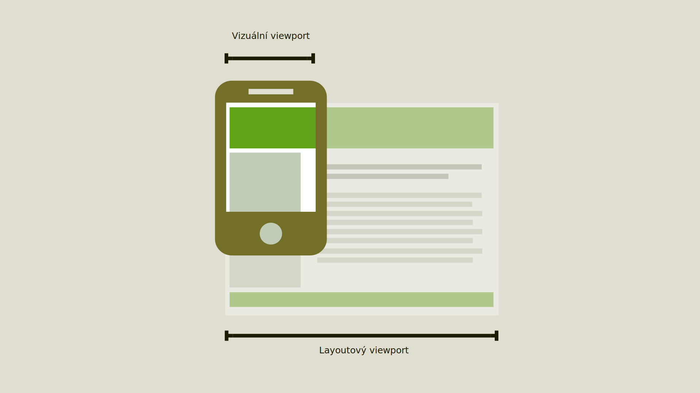

# Tři viewporty na mobilních zařízeních

Co je layoutový a co vizuální viewport? Co přesně přesně vyjadřuje `device-pixel-ratio` a proč nepoužívat `screen.width` v Javascriptu nebo `min-device-width` v CSS?

Pojďme si nejprve říct, co to ten *viewport* vlastně je. V kontextu webdesignu jde o označení pro výřez dokumentu viditelný v okně prohlížeče. 

Na zařízeních, kde je možné měnit velikost okna, typicky desktopových, tedy viewport představuje šířku a výšku okna bez rozhraní prohlížeče.

Správná legrace s viewportem ovšem začíná na moderních smartphonech a tabletech. Hlavně proto, že tam viewport není jen jeden. Budeme používat terminologii [Petera-Paula Kocha](http://www.quirksmode.org/mobile/metaviewport/) a rozlišovat viewport layoutový, vizuální a ideální.



## Layoutový viewport

Plocha, do které se vykresluje layout stránky. Layout napsaný v CSS se počítá právě z něj. A pro pořádek – z pohledu CSS je layoutový viewport tzv. „[initial containing block](http://reference.sitepoint.com/css/containingblock)“.

Šířka výchozí layoutového viewportu je na mobilních platformách podobná:

* IE10 na Win8: 1024 pixelů 
* iOS a Android: 980 pixelů 

Vezměme například tento zápis ručního nastavení viewportu:

```html
<meta name="viewport" content="width=1000">
``` 

Tím nastavíme sířku layoutového viewportu na 1000 pixelů.

Javascriptem rozměry layoutového viewportu zjistíte pomocí: 

```javascript
document.documentElement.clientWidth
document.documentElement.clientHeight
```

K layoutovému viewportu se vztahují [Media Queries](css3-media-queries.md) dotazy na velikost okna – `min-width` a `max-width`.

## Vizuální viewport

„Průzor“, přes který se díváte na layoutový viewport a tedy stránku samotnou. Neobsahuje ovládací prvky prohlížeče.

Při prvním vykreslení stránky na mobilním zařízení je obvykle velikost vizuálního viewportu stejná s layoutovým. Když ale například uživatel zoomuje stránku, zvětšuje nebo zmenšuje layoutový viewport. Vizuální zůstává pořád stejný.

Javascriptem rozměry vizuálního viewportu zjistíte pomocí: 

```javascript
window.innerWidth
window.innerHeight
```

## Ideální viewport

Ideální viewport je trochu z jiné kategorie než ty dva předchozí. Je to hodnota určená výrobcem prohlížeče. Představuje ideální rozměry layoutového viewportu a tedy webové stránky zobrazované na používaném zařízení. 

Ideální viewport získáte když vydělíte hardwarové rozlišení hodnotou [device-pixel-ratio](css-pixel.md). Pojďme se teď podívat na rozměry jednotlivých viewportů pro pár vybraných mobilních zařízení:

<table>
  <tr>
    <td></td>
    <td>Hardwarové
rozlišení</td>
    <td>Výchozí layoutový viewport</td>
    <td>Ideální viewport</td>
    <td>device-pixel-ratio</td>
  </tr>
  <tr>
    <td>iPhone 4 
/ iOS6 
/ Safari</td>
    <td>640×960</td>
    <td>980×1091</td>
    <td>320×480</td>
    <td>2</td>
  </tr>
  <tr>
    <td>iPad Air 
/ iOS8.1 
/ Safari</td>
    <td>1536×2048</td>
    <td>980×1225</td>
    <td>768×1024</td>
    <td>2</td>
  </tr>
  <tr>
    <td>Lumia 630 
/ WP8.1 
/ IE11</td>
    <td>480×800</td>
    <td>1024×1554</td>
    <td>480×800</td>
    <td>1</td>
  </tr>
  <tr>
    <td>Galaxy S5 
/ Android 4.4 
/ Android Browser</td>
    <td>1080×1920</td>
    <td>980×1532</td>
    <td>360×640</td>
    <td>3</td>
  </tr>
  <tr>
    <td>Nexus 6 
/ Android 5 
/ Android Browser</td>
    <td>1440 × 2560</td>
    <td>980×1402</td>
    <td>360×592</td>
    <td>4</td>
  </tr>
</table>

### Layoutový viewport na rozměry ideálního viewportu


U skoro všech responzivních webů chcete layoutový viewport nastavit na rozměry ideálního viewportu. Uděláte to pomocí [správné meta značky pro viewport](meta-viewport.md) a kousku CSS:

```html
<meta name="viewport" content="width=device-width, initial-scale=1">
```  

```css
@-ms-viewport { width: device-width }
``` 

### Proč nepoužívat `screen.width` a `min-device-width`?

Javascriptem se u některých prohlížečů dá ideální viewport zjistit pomocí `screen.width` a `screen.height`. Některé ovšem vracejí šířku a výšku displeje v hardwarových pixelech. Dělá to třeba Android Browser až do verze 4.2, takže je tato hodnota v praxi dost nepoužitelná. 

Javascriptové vlastnosti ideálního viewportu mají své protějšky v Media Queries `min-device-width` a `min-device-height` a i ty jsou tedy nejen díky tomu nepříliš použitelné.

Můžete pokračovat článkem o [meta značce pro viewport](viewport-meta.md) nebo [viewportu na Windows](viewport-windows.md).
